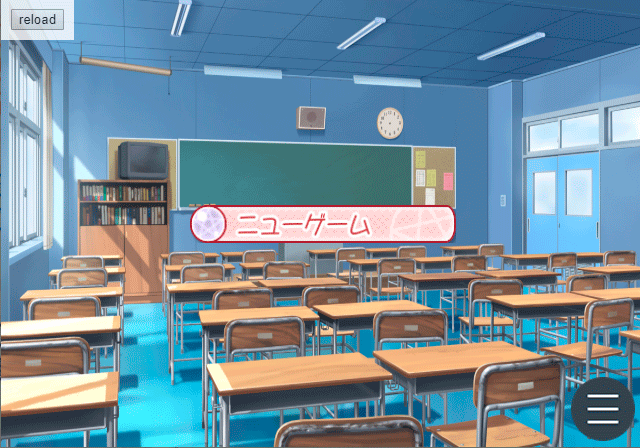

# Tyrano Builder Plugin Graphic button

You can create a button using images for the normal state and hover state. Additionally, you can also add sounds when clicked, hovered, and when leaving hover.

# Installation Instructions / インストール手順

## English

1. Open your project and go to the "Project" menu.
2. Select "Plugins" and a new window will open.
3. Click on "Add New" and choose the file `gbutton.tbp`.
   
   **Note:** Ensure that the plugin components are activated in your tool area. If not, go to the "Project" menu, then to "Customize tool area". In the "Components" tab, scroll down and check the boxes for "Plugins" and "Graphic button".

4. Once this is done, the plugin will be ready to use.

## 日本語

1. プロジェクトを開き、'Project' メニューに移動します。
2. 次に、'Plugins' を選択すると新しいウィンドウが開きます。
3. 'Add New' をクリックして、`gbutton.tbp` ファイルを選択します。
   
   **注意:** ツールエリアでプラグインのコンポーネントが有効になっていることを確認してください。有効になっていない場合は、'Project' メニューに移動し、'Customize tool area' を選択し、'Components' タブで下にスクロールして 'Plugins' と 'Graphic button' のチェックボックスをオンにします。

4. これで、プラグインが使用できるようになります。
